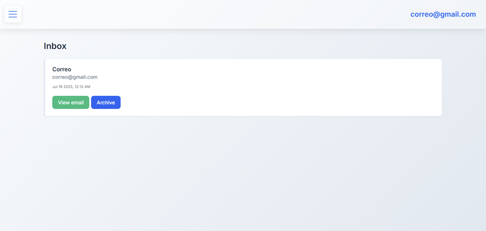
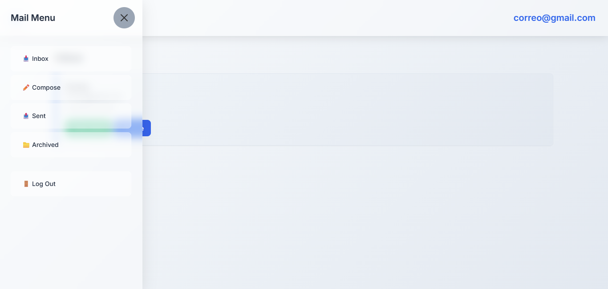
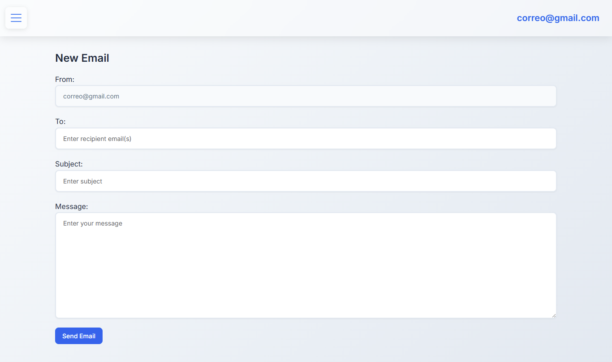

# 📬 Mail-Web50 — Email Web Client

**Mail-Web50** is a single-page application (SPA) email client built with **Django** and **JavaScript** for **CS50's Web Programming with Python and JavaScript (CS50W)**. It features a modern **glassmorphism** design and allows users to send, receive, archive, and reply to emails in a dynamic, responsive interface.



---

## ✨ Key Features

### 📧 Email Client

* Send emails between registered users
* View mailboxes: Inbox, Sent, and Archived
* Read individual emails
* Archive and unarchive received messages
* Quick reply with pre-filled fields (recipient, subject, quote)
* Visual distinction between read and unread emails
* Modern, responsive, and fluid SPA interface

---

## 🎨 Advanced CSS Design

### 🧊 Glassmorphism

* Translucent navigation bar with `backdrop-filter: blur(10px)`
* 40% opaque side menu with glass effect
* Buttons with sliding “shine” animation
* Clear backdrop without darkening



### 🗂 Z-Index Hierarchy

* Navbar (`z-index: 1050`): Always visible
* Side menu (`z-index: 1045`): Overlays background
* Backdrop (`z-index: 1040`): Intercepts clicks without darkening

### 🔍 Smart Visual States

* Unread emails: Blue border + gradient background
* Read emails: Gray border + white background
* Animations: `fadeIn` with `translateY` for smooth loading

### 🧩 Other Styling Features

* *Inter* typography (Google Fonts) with fallback
* Consistent CSS variables
* Custom-themed scrollbar
* Responsive design for 768px breakpoint
* Non-intrusive **Bootstrap 5** integration

---

## 🚀 Setup and Installation

1. Clone the repository:
   ```bash
   git clone https://github.com/Wesleykyle2005/Mail-Web50
   cd Mail-Web50
   ```
2. Install dependencies:
   ```bash
   pip install django
   ```
3. Apply migrations:
   ```bash
   python manage.py makemigrations mail
   python manage.py migrate
   ```
4. Run the server:
   ```bash
   python manage.py runserver
   ```
5. Access the app at: [http://127.0.0.1:8000/](http://127.0.0.1:8000/)

---

## 🧪 How to Use

* Register with any email and password (local functionality)
* Navigate mailboxes via the glassmorphism side menu
* Compose emails from the "Compose" view
* Click messages to read, archive, or reply quickly



---

## 🛠 System Requirements

* **Python 3.x**
* **Django 3.x** or higher
* Modern browser supporting `backdrop-filter` (Chrome, Edge, Safari)

---

## 📁 Project Structure

```
Mail-Web50/
├── mail/                    # Main application
│   ├── static/mail/
│   │   ├── inbox.js         # SPA JavaScript logic
│   │   └── styles.css       # CSS styles (glassmorphism)
│   ├── templates/mail/
│   │   ├── inbox.html       # Main inbox template
│   │   └── layout.html      # Base template
│   ├── models.py            # Email model
│   ├── views.py             # Views and REST API
│   └── urls.py              # App routing
├── project3/                # Django project settings
```

---

## 🔌 REST API Endpoints

* `GET /emails/<mailbox>` — Returns emails by mailbox (`inbox`, `sent`, `archive`)
* `GET /emails/<email_id>` — Retrieves an email by ID
* `POST /emails` — Sends a new email (`recipients`, `subject`, `body`)
* `PUT /emails/<email_id>` — Updates email status (`read`, `archived`)

---

## ✅ Implemented Features

### Client-Side Features

* Validated email sending
* Dynamic mailbox rendering with AJAX
* Individual email view with read marking
* Archive/unarchive emails
* Quick reply with pre-filled fields
* SPA functionality without page reloads
* Visual states for read/unread emails

### Unique CSS Contributions

1. Side menu without visual darkening
2. Animated “shine” effect on buttons
3. Visual states for read/unread emails
4. Persistent navbar visibility
5. Smooth CSS transitions
6. Custom scrollbar with theme integration
7. Fully mobile-compatible responsive design

---

## 🎨 Project Color Palette

* **Primary:** `#2563eb` — Modern blue
* **Secondary:** `#64748b` — Elegant gray
* **Success:** `#10b981` — Confirmation green
* **Warning:** `#f59e0b` — Warning yellow
* **Error:** `#ef4444` — Error red
* **Glassmorphism Base:** 40% opacity with blur

---

## 📱 Responsive Design

* Main breakpoint: `768px`
* Mobile side menu: `280px` wide
* Touch-friendly buttons: ≥ 44px
* Optimized animations for mobile performance (60 fps)
