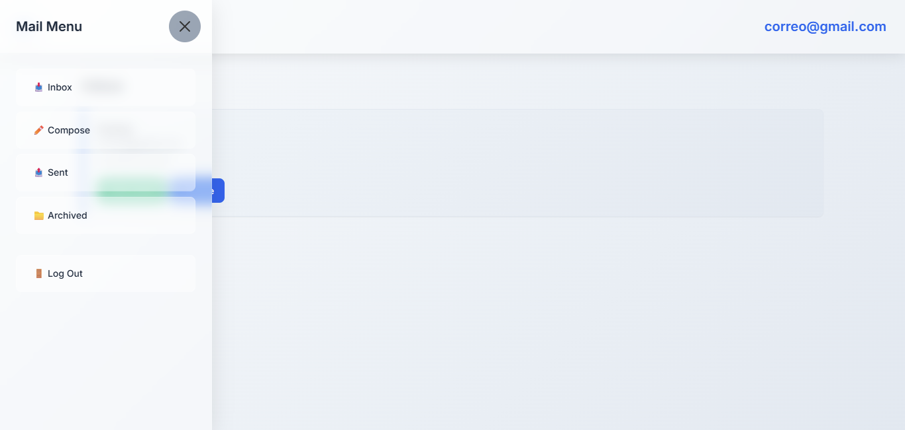
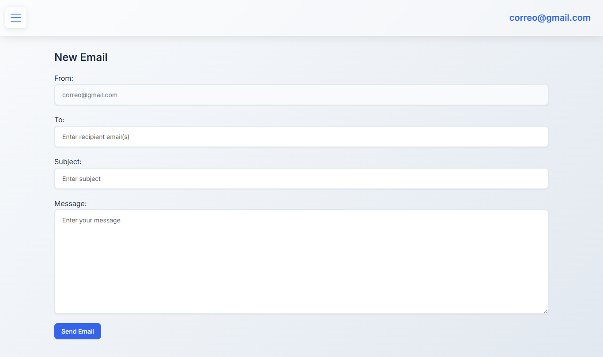

# 📬 Mail-Web50 — Cliente Web de Correo Electrónico

**Mail-Web50** es un cliente de correo electrónico de una sola página (SPA) desarrollado con **Django** y **JavaScript** para **CS50's Web Programming with Python and JavaScript (CS50W)**. Presenta un diseño moderno con **efectos glassmorphism** y permite enviar, recibir, archivar y responder correos en una interfaz dinámica y responsiva.


---

## ✨ Funcionalidades Principales

### 📧 Cliente de Correo Electrónico

* Enviar correos entre usuarios registrados
* Ver bandejas: Entrada, Enviados y Archivados
* Leer correos individuales
* Archivar y desarchivar mensajes recibidos
* Respuesta rápida con campos prellenados (destinatario, asunto, cita)
* Distinción visual entre correos leídos y no leídos
* Interfaz SPA moderna, responsiva y fluida

---

## 🎨 Diseño CSS Avanzado

### 🧊 Glassmorphism

* Barra de navegación translúcida con `backdrop-filter: blur(10px)`
* Menú lateral con 40% de opacidad y efecto cristal
* Botones con animación “shine” deslizante
* Fondo claro sin oscurecimiento



### 🗂 Jerarquía de Z-Index

* Navbar (`z-index: 1050`): Siempre visible
* Menú lateral (`z-index: 1045`): Superpuesto al fondo
* Fondo (`z-index: 1040`): Intercepta clics sin oscurecer

### 🔍 Estados Visuales Inteligentes

* Correos no leídos: Borde azul + fondo con gradiente
* Correos leídos: Borde gris + fondo blanco
* Animaciones: `fadeIn` con `translateY` para carga suave

### 🧩 Otras Características de Estilo

* Tipografía *Inter* (Google Fonts) con respaldo
* Variables CSS para consistencia
* Barra de desplazamiento personalizada
* Diseño responsivo para breakpoint de 768px
* Integración no intrusiva con **Bootstrap 5**

---

## 🚀 Instalación y Puesta en Marcha

1. Clona el repositorio:
   ```bash
   git clone https://github.com/Wesleykyle2005/Mail-Web50
   cd Mail-Web50
   ```
2. Instala dependencias:
   ```bash
   pip install django
   ```
3. Aplica migraciones:
   ```bash
   python manage.py makemigrations mail
   python manage.py migrate
   ```
4. Ejecuta el servidor:
   ```bash
   python manage.py runserver
   ```
5. Accede a la aplicación en: [http://127.0.0.1:8000/](http://127.0.0.1:8000/)

---

## 🧪 Modo de Uso

* Regístrate con cualquier correo y contraseña (funciona localmente)
* Navega entre bandejas desde el menú lateral con efecto glassmorphism
* Redacta correos desde la vista "Compose"
* Haz clic en un mensaje para leerlo, archivarlo o responder rápidamente



---

## 🛠 Requisitos del Sistema

* **Python 3.x**
* **Django 3.x** o superior
* Navegador moderno con soporte para `backdrop-filter` (Chrome, Edge, Safari)

---

## 📁 Estructura del Proyecto

```
Mail-Web50/
├── mail/                    # Aplicación principal
│   ├── static/mail/
│   │   ├── inbox.js         # Lógica JavaScript SPA
│   │   └── styles.css       # Estilos CSS (glassmorphism)
│   ├── templates/mail/
│   │   ├── inbox.html       # Plantilla de bandeja principal
│   │   └── layout.html      # Plantilla base
│   ├── models.py            # Modelo Email
│   ├── views.py             # Vistas y API REST
│   └── urls.py              # Enrutamiento de la aplicación
├── project3/                # Configuración del proyecto Django
```

---

## 🔌 Endpoints de la API REST

* `GET /emails/<mailbox>` — Devuelve correos por bandeja (`inbox`, `sent`, `archive`)
* `GET /emails/<email_id>` — Obtiene un correo por ID
* `POST /emails` — Envía un nuevo correo (`recipients`, `subject`, `body`)
* `PUT /emails/<email_id>` — Actualiza el estado de un correo (`read`, `archived`)

---

## ✅ Especificaciones Implementadas

### Funcionalidades del Lado del Cliente

* Envío de correos validado
* Renderizado dinámico de bandejas con AJAX
* Visualización de correos con marcado como leído
* Archivado/desarchivado de correos
* Respuesta rápida con campos prellenados
* Funcionalidad SPA sin recargas de página
* Estados visuales para correos leídos/no leídos

### Aportes CSS Únicos

1. Menú lateral sin oscurecimiento visual
2. Efecto “shine” animado en botones
3. Estados visuales para correos leídos/no leídos
4. Navbar con visibilidad persistente
5. Transiciones CSS suaves
6. Barra de desplazamiento personalizada con tema
7. Diseño responsivo totalmente compatible con móviles

---

## 🎨 Paleta de Colores del Proyecto

* **Primario:** `#2563eb` — Azul moderno
* **Secundario:** `#64748b` — Gris elegante
* **Éxito:** `#10b981` — Verde de confirmación
* **Advertencia:** `#f59e0b` — Amarillo de advertencia
* **Error:** `#ef4444` — Rojo de error
* **Base Glassmorphism:** 40% de opacidad con desenfoque

---

## 📱 Diseño Responsivo

* Breakpoint principal: `768px`
* Menú lateral móvil: `280px` de ancho
* Botones aptos para táctil: ≥ 44px
* Animaciones optimizadas para rendimiento móvil (60 fps)
